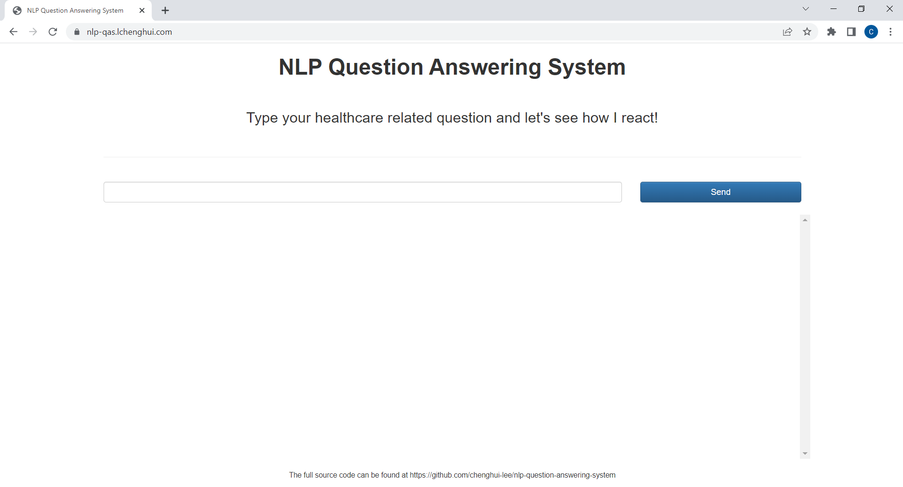

# nlp-question-answering-system


**NLP Question Answering System** is a question answering system that is able to answer your medical enquiries. 
It uses Natural Language Processing techniques to understand your question and match against the answer in the system.

Here are some sample questions:
- Why we need protein?
- What is red blood cells?
- What is vitamin c?
- How to increase stamina?

## Installation
Make sure you have the latest Python (3.9 and above).
- Clone this repository and cd into the directory
```
git clone https://github.com/chenghui-lee/nlp-healthcare-chatbot.git
cd nlp-healthcare-chatbot/
```
- Create Virtual Environment (venv) with the name venv
```
python -m venv venv
```
- Activate Virtual Environment 
```
# if you have Windows
venv\Scripts\activate

# if you have Linux
source venv/bin/activate
```
- Install dependencies
```
python -m pip install -r requirements.txt

or 

pip install -r requirements.txt
```
- Go to [Google Drive](https://drive.google.com/drive/folders/1I2decytopoJ9ArSkycLF9IUcYyl-3Qp_?usp=sharing) and download all the .pkl files. Put them into the resources/ folder.

## Run the program
```
python app.py
```
The program will be running on localhost:13500.

## Demo website
https://nlp-chatbot.lchenghui.com

## Group Members
Group Name: Group 3

Group Members:
- Lee Cheng Hui (17204205/1)
- Ting Wei Jing (17205876/1)
- Amos Tan Li Sheng (S2030533/1)
- Ong Jack Min (17207672/1)
- Soh Zhi Chen (17204929/1)

